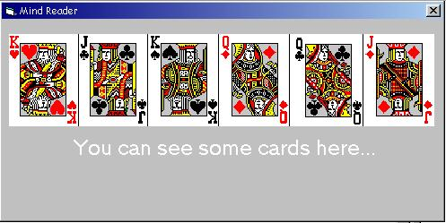



## \[ Mind Reader \]

### Description

This program will amaze you, and give you the creaps! It can read your mind. You'll have to see it to believe it. No joke! Just start the program and do not touch anything. Just pay attention and be surprised...really creapy :-O
 
### More Info
 

             |
---                |---
**Submitted On**   |2005-01-17 20:35:44
**By**             |[D\. Rijmenants](https://github.com/Planet-Source-Code/PSCIndex/blob/master/ByAuthor/d-rijmenants.md)
**Level**          |Intermediate
**User Rating**    |4.6 (32 globes from 7 users)
**Compatibility**  |VB 5\.0, VB 6\.0
**Category**       |[Miscellaneous](https://github.com/Planet-Source-Code/PSCIndex/blob/master/ByCategory/miscellaneous__1-1.md)
**World**          |[Visual Basic](https://github.com/Planet-Source-Code/PSCIndex/blob/master/ByWorld/visual-basic.md)
**Archive File**   |[\[\_Mind\_Rea1844311262005\.zip](https://github.com/Planet-Source-Code/d-rijmenants-mind-reader__1-58332/archive/master.zip)

